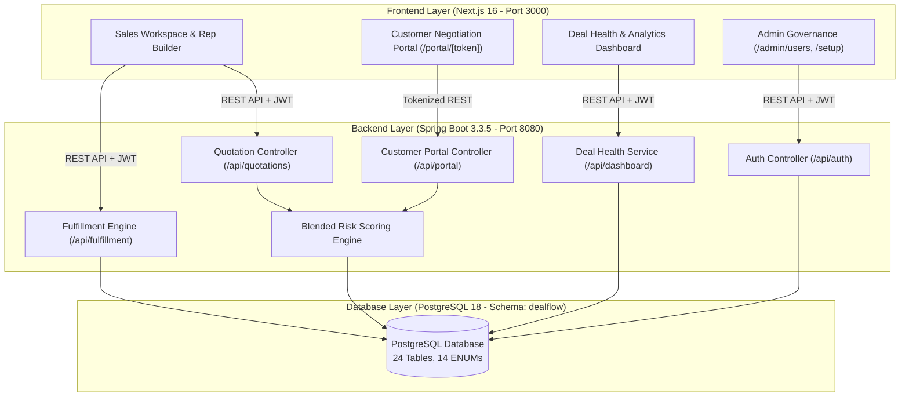

# DealFlow360 — Intelligent, Self-Governing Sales Operations Platform

Hackathon MVP | Built with Java Spring Boot 3.3.5, Next.js 16 (App Router), and PostgreSQL 18

---

## Table of Contents
1. [Executive Summary](#executive-summary)
2. [Project Overview & Core Business Problem](#project-overview--core-business-problem)
3. [Key Application Modules & Features](#key-application-modules--features)
4. [Complete Project Folder Structure](#complete-project-folder-structure)
   - [Backend Architecture & Package Structure](#backend-architecture--package-structure)
   - [Frontend App Router & Component Structure](#frontend-app-router--component-structure)
   - [Database Scripts & Configuration](#database-scripts--configuration)
5. [Core Business Logic & Algorithmic Engines](#core-business-logic--algorithmic-engines)
   - [1. Blended Risk Scoring Engine](#1-blended-risk-scoring-engine)
   - [2. Multi-Warehouse Greedy Fulfillment Algorithm](#2-multi-warehouse-greedy-fulfillment-algorithm)
   - [3. Deal Health & Anomaly Detection Engine](#3-deal-health--anomaly-detection-engine)
6. [User Roles & Governance](#user-roles--governance)
7. [System Architecture & Data Flow Diagrams](#system-architecture--data-flow-diagrams)
8. [Database Schema & Data Model](#database-schema--data-model)
9. [Setup & Installation Instructions](#setup--installation-instructions)
10. [Pre-Seeded Demo Accounts](#pre-seeded-demo-accounts)
11. [Future Roadmap](#future-roadmap)

---

## Executive Summary

DealFlow360 is an enterprise-grade, self-governing B2B Sales Operations Platform. It automates the end-to-end Quotation-to-Cash lifecycle — bridging the operational gaps between sales representatives, financial approvers, warehouse fulfillment teams, and external customers.

Unlike traditional static CRM or CPQ tools, DealFlow360 acts as an active deal engine that enforces pricing discipline, reacts to real-time inventory levels across multiple warehouses, manages hybrid billing (one-time physical items mixed with recurring subscriptions), and provides a live, interactive negotiation portal for customers.

---

## Project Overview & Core Business Problem

### The Realities of B2B Sales
Most standard sales applications handle simple, linear workflows: create a quote, confirm an order, and issue an invoice. Real-world B2B sales operations, however, face complex operational friction:
- Uncontrolled Discounting: Sales representatives grant high discounts to close deals, eroding gross margins without manager visibility.
- Inventory Disconnects: Orders are confirmed for items that are out of stock or split across remote warehouses.
- Hybrid Order Complexity: One-time hardware sales, professional services, and recurring subscriptions (SaaS/Maintenance) are handled in disconnected tools.
- Email Negotiation Bottlenecks: Customer change requests and counter-offers get lost in lengthy email threads.
- Deal Slippage Blindness: Managers only discover stuck or high-risk deals weeks after momentum is lost.

### The DealFlow360 Solution
DealFlow360 transforms the static quotation into a living, negotiable contract backed by real-time automated governance:
1. Self-Governing Approvals: Calculates a Blended Risk Score for every quote and automatically routes it for Sales Manager and Finance approval.
2. Fulfillment Intelligence: Analyzes stock across warehouses, suggests optimal splits to minimize shipping costs, and manages backorders.
3. Hybrid Billing Engine: Combines one-time items and recurring subscription schedules (Monthly, Quarterly, Yearly) with proration logic on a single order.
4. Interactive Customer Portal: Allows customers to review line items, post comments, propose counter-discounts, and sign quotes digitally.
5. Real-Time Deal Health Monitoring: Identifies inactive deals (>7 days idle), discount anomalies (>1.5x rep historical average), and delivery slippage before revenue is impacted.

---

## Key Application Modules & Features

### 1. Multi-Tier Discount Governance & Approval Chains
- Customer Tier Ceilings: Bronze (up to 5%), Silver (up to 10%), Gold (up to 15%).
- Category Specific Caps: Product categories define maximum allowable discount discretion.
- Automated Approval Routing: Low/Medium risk quotes require Sales Manager approval; High risk quotes require sequential Sales Manager followed by Finance approval. Zero-risk quotes are auto-approved.

### 2. Live Upsell & Cross-Sell Recommendation Engine
- Co-Purchase Intelligence: Ranks product recommendations based on historical co-purchase pairings and active promotions.
- Live Margin Feedback: Displays immediate margin delta (+/- %) when adding recommended items to the cart.

### 3. Multi-Warehouse Fulfillment & Backorder Split Engine
- Greedy Stock Allocation: Automatically selects warehouses with highest stock, weighted by shipping cost rules.
- Backorder Handling: Unfulfilled quantities generate automatic backorders with estimated 7-day fulfillment windows.

### 4. Hybrid Revenue & Subscription Billing
- Mixed Line Types: Supports one-time physical/service lines alongside recurring subscription lines.
- Billing Schedules & Proration: Generates recurring billing schedules and handles mid-cycle quantity/plan modifications.

### 5. Customer Negotiation Portal
- Tokenized Secure Access: Accessible via tokenized URLs (`/portal/[token]`).
- Line-Level Collaboration: Customers can leave comments on specific line items or propose counter-discounts.
- Auto Re-Approval Guard: If customer counter-proposals exceed risk thresholds, the quote automatically re-enters the approval chain.

### 6. Deal Health & Anomaly Dashboard
- Stalled Deal Alerts: Identifies deals inactive for more than 7 days.
- Discount Anomaly Alerts: Flags discounts exceeding 1.5x a rep's historical average.
- Delivery Slippage Alerts: Monitors unresolved backorders nearing target delivery dates.

### 7. Setup Wizard & User Governance
- First-Admin Setup Wizard (`/setup`): Creates the initial root administrator on fresh deployments.
- User Management (`/admin/users`): Allows administrators to provision Sales Reps, Managers, and Finance staff with temporary passwords and audit tracking.

---

## Complete Project Folder Structure

### Backend Architecture & Package Structure

```
backend/
├── pom.xml                                      # Maven Build Manifest & Dependencies
├── src/
    └── main/
        ├── java/
        │   └── com/
        │       └── dealflow360/
        │           ├── DealFlow360Application.java  # Spring Boot Main Entry Point
        │           │
        │           ├── config/                  # Configuration & Initialization Beans
        │           │   ├── DataInitializer.java # DB Password Sync & Initial Seed Checker
        │           │   ├── JacksonConfig.java   # JSON Serialization & Date Format Rules
        │           │   └── SecurityConfig.java  # Spring Security, CORS & RBAC Filter Chain
        │           │
        │           ├── controller/              # REST API Controllers (HTTP Endpoints)
        │           │   ├── AdminUserController.java     # User Governance & Staff Provisioning (/api/admin/users)
        │           │   ├── AuthController.java          # Auth, Login, Registration & JWT Refresh (/api/auth)
        │           │   ├── CustomerController.java      # Customer CRUD Operations (/api/customers)
        │           │   ├── CustomerPortalController.java# Customer Negotiation Portal API (/api/portal)
        │           │   ├── DashboardController.java     # Executive Analytics & Deal Health Alerts (/api/dashboard)
        │           │   ├── DiscountTierController.java  # Discount Rules & Customer Tiers (/api/discount-tiers)
        │           │   ├── FulfillmentController.java   # Warehouse Splits & Backorder Management (/api/fulfillment)
        │           │   ├── ProductController.java       # Catalog, Categories & Price Lists (/api/products)
        │           │   ├── QuotationController.java     # Quote Builder, Submissions & Approvals (/api/quotations)
        │           │   ├── SetupController.java         # First-Admin Setup Wizard API (/api/setup)
        │           │   └── SubscriptionPlanController.java # Subscription Plans & Billing Schedules (/api/subscriptions)
        │           │
        │           ├── entity/                  # JPA Database Entities (PostgreSQL Mappings)
        │           │   ├── Approval.java             # Approval Chain Requests
        │           │   ├── ApprovalAuditLog.java     # Audit Log for Approval Decisions
        │           │   ├── Customer.java             # Customer Profiles & Tiers
        │           │   ├── DealHealthAlert.java      # Stalled Deals & Anomaly Alerts
        │           │   ├── DiscountTier.java         # Customer Tier Discount Ceilings
        │           │   ├── FulfillmentLine.java      # Individual Warehouse Line Allocations
        │           │   ├── FulfillmentOrder.java     # Warehouse Fulfillment Orders
        │           │   ├── Invoice.java              # Invoices & Billing Records
        │           │   ├── NegotiationComment.java   # Line-Item Portal Comments & Counter-Offers
        │           │   ├── PriceList.java            # Tier-Based Pricing Rules
        │           │   ├── Product.java              # Product Master Catalog
        │           │   ├── ProductCategory.java      # Product Categories & Max Discounts
        │           │   ├── ProductVariant.java       # Product Attributes & Price Adjustments
        │           │   ├── Quotation.java            # Quotation Header Record
        │           │   ├── QuotationLine.java        # Quotation Line Items (One-Time & Recurring)
        │           │   ├── UpsellRule.java           # Cross-Sell / Upsell Pairings & Margins
        │           │   ├── User.java                 # User Accounts & System Roles
        │           │   ├── UserAuditLog.java         # Administrative User Management Log
        │           │   ├── Warehouse.java            # Warehouse Facilities
        │           │   └── WarehouseStock.java       # Inventory Levels per Warehouse
        │           │
        │           ├── exception/               # Global Exception Handlers
        │           │   ├── BadRequestException.java
        │           │   ├── GlobalExceptionHandler.java
        │           │   └── ResourceNotFoundException.java
        │           │
        │           ├── repository/              # Spring Data JPA Repository Interfaces
        │           │   ├── ApprovalAuditLogRepository.java
        │           │   ├── ApprovalRepository.java
        │           │   ├── CustomerRepository.java
        │           │   ├── DealHealthAlertRepository.java
        │           │   ├── DiscountTierRepository.java
        │           │   ├── FulfillmentOrderRepository.java
        │           │   ├── InvoiceRepository.java
        │           │   ├── NegotiationCommentRepository.java
        │           │   ├── ProductCategoryRepository.java
        │           │   ├── ProductRepository.java
        │           │   ├── QuotationRepository.java
        │           │   ├── UpsellRuleRepository.java
        │           │   ├── UserAuditLogRepository.java
        │           │   ├── UserRepository.java
        │           │   ├── WarehouseRepository.java
        │           │   └── WarehouseStockRepository.java
        │           │
        │           ├── security/                # JWT Authentication Infrastructure
        │           │   ├── CustomAccessDeniedHandler.java
        │           │   ├── CustomUserDetailsService.java
        │           │   ├── JwtAuthenticationEntryPoint.java
        │           │   ├── JwtAuthenticationFilter.java
        │           │   └── JwtTokenProvider.java
        │           │
        │           └── service/                 # Core Business Logic & Scoring Services
        │               ├── AdminUserService.java        # Staff Provisioning Logic
        │               ├── AuthService.java             # User Authentication & JWT Issuance
        │               ├── BlendedRiskScoringService.java # Blended Risk Calculation Engine
        │               ├── DealHealthService.java       # Deal Health Monitoring & Alerting
        │               ├── FulfillmentService.java      # Greedy Multi-Warehouse Allocation
        │               ├── QuotationService.java        # Quotation Workflow & Status State Machine
        │               └── SetupService.java            # First-Admin Wizard Setup Service
        │
        └── resources/
            ├── application.yml                  # Database Connections, Server Port & JWT Configuration
            ├── application-dev.yml              # Development Profile Overrides
            └── application-prod.yml             # Production Profile Overrides
```

---

### Frontend App Router & Component Structure

```
frontend/
├── package.json                                 # Dependencies & Scripts (Next.js 16, React Query, Axios)
├── next.config.ts                               # Next.js Build & Compiler Configuration
├── tsconfig.json                                # TypeScript Compiler Options
├── app/                                         # Next.js 16 App Router Directory
│   ├── layout.tsx                               # Root Layout (Google Fonts, Global Providers)
│   ├── page.tsx                                 # Main Landing & Interactive Login Page
│   ├── globals.css                              # Design System Tokens, CSS Variables & Themes
│   │
│   ├── admin/
│   │   └── users/
│   │       └── page.tsx                         # User Governance & Staff Management Interface
│   ├── approvals/
│   │   ├── page.tsx                             # Manager & Finance Approval Queue Dashboard
│   │   └── [id]/
│   │       └── page.tsx                         # Detailed Quote Approval Review & Stepper Inspector
│   ├── customers/
│   │   └── page.tsx                             # Customer Directory & Account Management
│   ├── dashboard/
│   │   └── page.tsx                             # Executive Sales Operations Dashboard
│   ├── deal-health/
│   │   └── page.tsx                             # Deal Health Anomaly & Stalled Deal Monitor
│   ├── fulfillment/
│   │   ├── page.tsx                             # Warehouse Fulfillment Orders & Split Status
│   │   └── [id]/
│   │       └── page.tsx                         # Detailed Warehouse Split & Backorder Manager
│   ├── invoices/
│   │   ├── page.tsx                             # Invoice Directory & Payment Tracking
│   │   └── [id]/
│   │       └── page.tsx                         # Detailed Invoice View & Credit Notes
│   ├── login/
│   │   └── page.tsx                             # Standalone Login Page
│   ├── portal/
│   │   ├── login/
│   │   │   └── page.tsx                         # Customer Portal Login Screen
│   │   └── [token]/
│   │       └── page.tsx                         # Tokenized Customer Negotiation Portal
│   ├── products/
│   │   └── page.tsx                             # Product Catalog, Categories & Price Lists
│   ├── quotations/
│   │   ├── page.tsx                             # Quotation List & Deal Pipeline Kanban View
│   │   └── [id]/
│   │       └── page.tsx                         # Interactive Quotation Builder & Cart Inspector
│   ├── register/
│   │   └── page.tsx                             # Customer Registration Page
│   ├── reports/
│   │   └── page.tsx                             # Sales Analytics & Filtered Reporting Area
│   ├── setup/
│   │   └── page.tsx                             # One-Time First-Admin Setup Wizard Page
│   ├── signup/
│   │   └── page.tsx                             # Internal Rep Sign-Up Page
│   └── subscriptions/
│       ├── page.tsx                             # Subscription Directory & Billing Schedules
│       └── [id]/
│           └── page.tsx                         # Detailed Subscription Inspector & Proration Tool
│
├── components/                                  # Reusable UI Components
│   ├── AppLayout.tsx                            # Primary Application Shell & Page Wrapper
│   ├── ApprovalStepperInspector.tsx            # Multi-Step Visual Approval Chain Inspector
│   ├── HeaderNavbar.tsx                         # Top Navigation Bar with Quick Actions
│   ├── NavbarButton.tsx                         # Styled Navigation Buttons
│   ├── RoleGovernanceList.tsx                   # User Role & Permissions Governance View
│   └── Sidebar.tsx                              # Navigation Sidebar Menu
│
└── lib/                                         # Utility Modules & API Integration
    ├── api.ts                                   # Axios Client with Auth Interceptors & API Functions
    └── permissions.ts                           # Role-Based Access Control Rules & Guards
```

---

### Database Scripts & Configuration

```
database/
├── schema.sql                                   # Full PostgreSQL Schema (Tables, ENUMs, Indices)
├── seed.sql                                     # 300+ Row Demonstration Seed Dataset
├── seed_300.sql                                 # Complete Seed Backup Script
├── fix_passwords.sql                            # BCrypt Password Hash Synchronization Script
├── dump_seed_300_sql.py                         # SQL Seed Extractor Script
└── generate_seed_300.py                         # Data Generator Script for Large Datasets
```

---

## Core Business Logic & Algorithmic Engines

### 1. Blended Risk Scoring Engine

When a quotation contains items across multiple product categories with varying customer tier discount limits, DealFlow360 computes a unified Blended Risk Score:

$$\text{Risk Score} = \text{Worst Line Peak Score} + (\text{Total Over-Limit Percentage} \times 0.5)$$

#### Threshold Matrix:
- Score = 0: `AUTO_APPROVED` (No governance intervention required)
- Score 0.1 – 4.9 (`LOW`): Requires Sales Manager approval.
- Score 5.0 – 7.9 (`MEDIUM`): Requires Sales Manager approval.
- Score >= 8.0 (`HIGH`): Requires Sales Manager followed by Finance approval.

---

### 2. Multi-Warehouse Greedy Fulfillment Algorithm

To fulfill an order, the system evaluates available stock across all warehouses and allocates inventory using a cost-weighted greedy approach:

1. Sort Warehouses: Warehouses with available stock are sorted by `shipping_cost_weight` ascending (preferring cheaper/nearer warehouses).
2. Stock Allocation: Allocates maximum available stock from the primary warehouse. If stock is insufficient, remaining items are split to secondary warehouses.
3. Backorder Handling: Any unfulfilled quantity after checking all warehouses is automatically flagged as a `BACKORDER` with an estimated 7-day replenishment window.

---

### 3. Deal Health & Anomaly Detection Engine

The backend continuously scans active quotations for risk patterns:
- Stalled Deals: Quotes remaining in `DRAFT` or `PENDING_APPROVAL` status for more than 7 days trigger a `STALLED_DEAL` alert.
- Discount Anomalies: Line discounts exceeding 1.5x the rep's historical average trigger a `DISCOUNT_ANOMALY` alert.
- Delivery Slippage: Unresolved backorders nearing target delivery dates trigger a `DELIVERY_SLIPPAGE` alert.

---

## User Roles & Governance

| Role | Key Permissions & Responsibilities |
|---|---|
| Sales Rep | Builds quotations, applies line/order discounts, reviews upsell suggestions, responds to customer negotiations, and tracks fulfillment. |
| Sales Manager | Reviews Level-1 discount approvals (Medium risk), configures discount tiers/ceilings, and monitors team deal health. |
| Finance User | Reviews Level-2 discount approvals (High risk), approves credit exceptions, manages warehouse fulfillment splits, and oversees recurring billing. |
| Customer (Portal) | Accesses quotes securely via tokenized URL, submits line-level questions/comments, proposes counter-discounts, and accepts final terms. |
| Administrator | Configures system defaults (products, price lists, warehouses, subscription plans) and manages internal user provisioning via `/admin/users`. |

---

## System Architecture & Data Flow Diagrams

### System Architecture Diagram



---

## Database Schema & Data Model

The database uses a PostgreSQL schema named `dealflow` containing 24 relational tables and 14 custom ENUM types:

### Core Tables:
- `users`: Internal staff accounts, hashed passwords, roles, and status.
- `customers`: Customer profiles, company details, assigned reps, and tier assignments.
- `products` & `product_categories`: Catalog items, attributes, and discount ceilings.
- `quotations` & `quotation_lines`: Quotation header records, line items, discounts, and risk scores.
- `approvals` & `approval_audit_logs`: Multi-tier approval routing states and decision audit trails.
- `warehouses` & `warehouse_stock`: Warehouse locations, replenishment thresholds, and inventory.
- `fulfillment_orders` & `fulfillment_lines`: Warehouse shipment splits and backorders.
- `invoices` & `subscriptions`: One-time billing invoices and recurring subscription schedules.
- `deal_health_alerts`: System-generated alerts for stalled deals and discount anomalies.
- `negotiation_comments`: Line-item portal comments and counter-proposal logs.

---

## Setup & Installation Instructions

### Prerequisites
- Java: JDK 21
- Node.js: v22+
- Database: PostgreSQL 18 (running locally on port 5432)
- Maven: 3.9+ (or use the backend wrapper)

---

### Step 1: Database Setup & Seeding

```bash
# 1. Connect to PostgreSQL and create database
psql -U postgres -c "CREATE DATABASE dealflow360;"

# 2. Execute schema, seed data, and password fix scripts
psql -U postgres -d dealflow360 -f database/schema.sql
psql -U postgres -d dealflow360 -f database/seed.sql
psql -U postgres -d dealflow360 -f database/fix_passwords.sql

# 3. Synchronize sequence values to max IDs
psql -U postgres -d dealflow360 -c "
DO \$\$
DECLARE
    rec RECORD;
BEGIN
    FOR rec IN 
        SELECT table_name, column_name, pg_get_serial_sequence('dealflow.' || table_name, column_name) as seq_name
        FROM information_schema.columns
        WHERE table_schema = 'dealflow' 
          AND pg_get_serial_sequence('dealflow.' || table_name, column_name) IS NOT NULL
    LOOP
        EXECUTE format('SELECT setval(%L, COALESCE((SELECT MAX(%I) FROM dealflow.%I), 1))', rec.seq_name, rec.column_name, rec.table_name);
    END LOOP;
END \$\$;
"
```

---

### Step 2: Start Backend (Spring Boot)

```bash
# Option A: Run using provided shell script
chmod +x ./run-backend.sh
./run-backend.sh

# Option B: Run via Maven
cd backend
export DB_URL="jdbc:postgresql://localhost:5432/dealflow360?stringtype=unspecified"
export DB_USERNAME="postgres"
export DB_PASSWORD="root"
export JWT_SECRET="dealflow360-super-secret-key-must-be-at-least-32-chars-long!"
mvn spring-boot:run
```
*Backend will be active at http://localhost:8080*.

---

### Step 3: Start Frontend (Next.js)

```bash
cd frontend
npm install
npm run dev
```
*Frontend will be active at http://localhost:3000*.

---

## Pre-Seeded Demo Accounts

All demo accounts have been pre-seeded with the password: `Password123!`

| Role | Email Address | Description & Access |
|---|---|---|
| Admin | `admin@dealflow360.com` | Full administrative & user governance access. |
| Sales Manager | `manager@dealflow360.com` | Reviews Level-1 approvals and monitors team pipeline. |
| Finance | `finance@dealflow360.com` | Reviews Level-2 approvals, fulfillment splits, & credit. |
| Sales Rep | `rep1@dealflow360.com` | Builds quotes, applies discounts, & handles deals. |
| Customer Portal | Tokenized Link | Access via link on quotation detail page or demo chip on `/portal/login`. |

---

## Future Roadmap

1. SMTP Email Notifications: Automated email dispatch for approval requests, portal links, and backorder updates.
2. OpenAPI / Swagger Documentation: Embedded API documentation using `springdoc-openapi-starter-webmvc-ui`.
3. Docker Compose Orchestration: Single-command `docker-compose up` containerization for PostgreSQL, Spring Boot, and Next.js.
4. WebSocket Live Updates: Real-time push updates for approval status changes and portal negotiation comments.
5. PDF & Excel Export: Formal quotation PDF generation using Apache POI & iText.
6. Multi-Currency Support: Live exchange rate integration for international deals.
